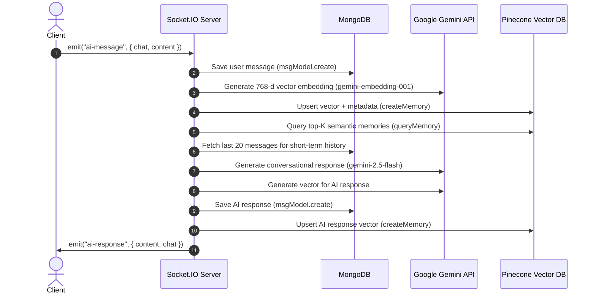

# ChatGPT Backend (Project-GPT)

A scalable Node.js and Express backend API for a ChatGPT clone application. It provides user authentication, real-time AI conversational chat using Google Gemini, semantic long-term memory powered by Pinecone Vector Database, WebSocket communication via Socket.IO, and persistent conversation history using MongoDB (Mongoose).

---

## 🚀 Features Implemented

- **User Authentication**:
  - Registration (`POST /api/auth/register`) with hashed passwords using `bcryptjs`.
  - Login (`POST /api/auth/login`) with JWT tokens signed and delivered in secure HTTP cookies (`cookie-parser`).
  - Route protection middleware (`authUser`) verifying JWT tokens.
- **Chat Session Management**:
  - Create new chat threads (`POST /api/chat/`) linked to the authenticated user.
- **Google Gemini AI Integration**:
  - Chat completions powered by `@google/genai` using the `gemini-2.5-flash` model.
  - Multi-turn conversation awareness with recent conversation history.
  - Text embedding generation using `gemini-embedding-001` (768-dimensional dense vector embeddings).
- **Long-Term Memory & Vector Search (Pinecone)**:
  - Vector database integration via `@pinecone-database/pinecone` (v8).
  - Automatically embeds and indexes both user questions and AI responses with metadata (`id`, `chat`, `text`, `role`).
  - Semantic similarity query (`queryMemory`) to retrieve relevant past context across sessions.
- **Real-Time Communication (Socket.IO)**:
  - Flexible handshake authentication supporting JWT tokens via Cookies, Auth payload, Authorization headers, or Query parameters.
  - Real-time `ai-message` event pipeline: stores messages, creates vector embeddings, queries semantic memory, loads short-term history, triggers Gemini AI, indexes the response, and emits `ai-response`.
- **Database & Message Persistence**:
  - MongoDB connection using `mongoose` with custom DNS configuration.
  - Message schema storing conversation history with role tagging (`user` vs `model`).

---

## 🔄 Real-Time Message Pipeline



---

## 🛠️ Tech Stack & Dependencies

| Technology                       | Purpose                                                      |
| -------------------------------- | ------------------------------------------------------------ |
| **Node.js & Express.js**         | Backend server framework & REST API routing                  |
| **MongoDB & Mongoose**           | NoSQL database & document modeling                           |
| **Pinecone Vector Database**     | Long-term vector memory & semantic similarity search         |
| **Google Gemini API**            | Generative AI completions (`gemini-2.5-flash`) & embeddings  |
| **Socket.IO**                    | Full-duplex real-time WebSocket communication                |
| **JSONWebToken (JWT)**           | Stateless user authentication & session management           |
| **BcryptJS**                     | Secure one-way password hashing                              |
| **Cookie & Cookie-Parser**       | HTTP cookie parsing and token handling                       |
| **Dotenv**                       | Environment variable configuration                           |
| **Nodemon**                      | Development server live reloading                            |

---

## 📁 Project Structure

```text
ChatGpt-Backend/
├── .env                       # Environment variables (Mongo, JWT, Gemini, Pinecone)
├── .gitignore                 # Files to ignore in Git
├── package.json               # Project dependencies and scripts
├── server.js                  # Entry point (HTTP server, DB connection & Socket initializer)
└── src/
    ├── app.js                 # Express app initialization & middleware configuration
    ├── database/
    │   └── db.js              # MongoDB database connection configuration
    ├── Sockets/
    │   └── sockets.server.js  # Socket.IO authentication, events, vector memory & AI pipeline
    ├── Services/
    │   ├── ai.service.js      # Google Gemini completion & vector embedding service
    │   └── vector.service.js  # Pinecone index upsert & semantic query service
    ├── Middlewares/
    │   └── auth.middleware.js # Middleware for protecting HTTP routes via JWT
    ├── models/
    │   ├── user.model.js      # User schema (email, fullname, password)
    │   ├── chat.model.js      # Chat schema (user reference, title, lastActive)
    │   └── msg.model.js       # Message schema (chat, user, content, role)
    ├── controllers/
    │   ├── auth.controller.js # Logic for user registration & login
    │   └── chat.controller.js # Logic for creating and managing chats
    └── routes/
        ├── auth.routes.js     # Auth API endpoint definitions
        └── chat.routes.js     # Chat API endpoint definitions
```

---

## 🔑 Environment Variables

Create a `.env` file in the project root directory with the following configuration:

```env
PORT=3000
MONGO_URL=mongodb+srv://<username>:<password>@<cluster>.mongodb.net/ChatGPT
JWT_SECRET=your_super_secret_jwt_key
GEMINI_API_KEY=your_google_gemini_api_key
PINECONE_API_KEY=your_pinecone_api_key
```

> **Note**: Ensure your Pinecone account has an index named `project-gpt` created with **768 dimensions** and **cosine** metric to match `gemini-embedding-001`.

---

## ⚙️ Installation & Setup

1. **Clone the Repository**:
   ```bash
   git clone https://github.com/itsam-13/Project-GPT.git
   cd ChatGpt-Backend
   ```

2. **Install Dependencies**:
   ```bash
   npm install
   ```

3. **Configure Environment Variables**:
   Create your `.env` file and supply `MONGO_URL`, `JWT_SECRET`, `GEMINI_API_KEY`, and `PINECONE_API_KEY`.

4. **Run the Development Server**:
   ```bash
   npm run dev
   ```

   The server will start on `http://localhost:3000`.

---

## 🔌 HTTP API Endpoints

### Authentication Routes (`/api/auth`)

| Method | Endpoint             | Description                            | Auth Required |
| ------ | -------------------- | -------------------------------------- | ------------- |
| `POST` | `/api/auth/register` | Register a new user                    | ❌ No         |
| `POST` | `/api/auth/login`    | Login user & receive HTTP cookie token | ❌ No         |

#### Register Request Body:
```json
{
  "email": "user@example.com",
  "fullName": {
    "firstName": "John",
    "lastName": "Doe"
  },
  "password": "yourpassword"
}
```

#### Login Request Body:
```json
{
  "email": "user@example.com",
  "password": "yourpassword"
}
```

---

### Chat Routes (`/api/chat`)

| Method | Endpoint     | Description               | Auth Required         |
| ------ | ------------ | ------------------------- | --------------------- |
| `POST` | `/api/chat/` | Create a new chat session | ✅ Yes (Cookie / JWT) |

#### Create Chat Request Body:
```json
{
  "title": "Discussion on Node.js"
}
```

---

## ⚡ Socket.IO Real-Time AI Chat

### 1. Connection & Authentication

Clients can authenticate via any of the following methods during the Socket.IO handshake:

- **Auth Payload**: `{ auth: { token: "YOUR_JWT_TOKEN" } }`
- **Cookies**: `Cookie: token=YOUR_JWT_TOKEN`
- **Authorization Header**: `Authorization: Bearer YOUR_JWT_TOKEN`
- **Query Parameter**: `?token=YOUR_JWT_TOKEN`

### 2. Client-Side Implementation Example

```javascript
import { io } from "socket.io-client";

const socket = io("http://localhost:3000", {
  auth: {
    token: "YOUR_JWT_TOKEN"
  },
  withCredentials: true
});

socket.on("connect", () => {
  console.log("Connected to AI Socket server:", socket.id);
});

// Send a message to the AI
socket.emit("ai-message", {
  chat: "66d1234567890abcdef12345", // Chat ObjectId
  content: "Can you explain vector databases and Pinecone?"
});

// Listen for AI Response
socket.on("ai-response", (data) => {
  console.log("AI Response:", data.content);
  console.log("Chat ID:", data.chat);
});

// Listen for Errors
socket.on("ai-error", (err) => {
  console.error("AI Error:", err.message);
});
```

### 3. Events Summary

| Event         | Direction       | Payload                             | Description                                            |
| ------------- | --------------- | ----------------------------------- | ------------------------------------------------------ |
| `ai-message`  | Client ➔ Server | `{ chat: string, content: string }` | Sends a prompt to the AI within a specific chat thread |
| `ai-response` | Server ➔ Client | `{ chat: string, content: string }` | Returns the generated Gemini AI response               |
| `ai-error`    | Server ➔ Client | `{ chat: string, message: string }` | Emitted when an error occurs during AI processing      |
