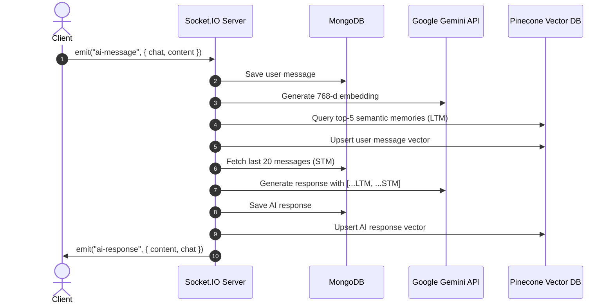

# GPT Clone
> 🔧 Backend-focused project

A ChatGPT clone with a **Node.js + Express** backend powering real-time AI chat via Google Gemini, dual-layer memory (MongoDB STM + Pinecone LTM), and Socket.IO. Includes a lightweight React frontend for UI demonstration.

---

## ✨ Frontend Features

- **Login & Register pages** with animated floating orb backgrounds and glassmorphism cards
- **Mobile-first responsive design** — sidebar drawer on mobile, inline on desktop
- **Auto dark/light theme** via `prefers-color-scheme` CSS media query — no JavaScript needed
- **Centralized CSS variables** in `styles/theme.css` for easy theming
- **Inline error handling** on auth forms — prompts user to register if account not found
- **Home/Chat page** with collapsible sidebar, conversation history, and suggestion cards
- Axios-based API integration with `withCredentials` for cookie auth

---

## 🚀 Backend Features

- **User Authentication** — Register & Login with bcrypt password hashing and JWT in HTTP cookies
- **Google Gemini AI** — Chat completions via `gemini-2.5-flash`, embeddings via `gemini-embedding-001`
- **Dual-Layer Memory**:
  - **STM** — Last 20 messages from MongoDB for conversational continuity
  - **LTM** — Pinecone vector similarity search across all past chats
- **Real-Time Chat** via Socket.IO with flexible JWT handshake (Cookie / Auth / Header / Query)
- **MongoDB + Mongoose** — Persistent users, chats, and messages
- **CORS** configured for `http://localhost:5173`

---

## 🔄 Real-Time Message Pipeline



---

## 🛠️ Tech Stack

| Layer | Technology | Purpose |
|-------|-----------|---------|
| **Frontend** | React 19 + Vite | UI framework & dev server |
| **Frontend** | React Router v7 | Client-side routing |
| **Frontend** | Axios | HTTP requests with cookie support |
| **Frontend** | CSS Variables | Centralized dark/light theming |
| **Backend** | Node.js + Express | REST API server |
| **Backend** | MongoDB + Mongoose | User, chat & message persistence |
| **Backend** | Pinecone | Long-term vector memory (LTM) |
| **Backend** | Google Gemini API | AI completions & embeddings |
| **Backend** | Socket.IO | Real-time bidirectional chat |
| **Backend** | JWT + bcryptjs | Auth & password hashing |
| **Backend** | Cookie-Parser + CORS | Cookie handling & cross-origin config |

---

## 📁 Project Structure

```text
ChatGpt-Backend/
├── FrontEnd/                      # React + Vite frontend
│   └── src/
│       ├── App.jsx                # Root component
│       ├── App.css                # Global reset + theme import
│       ├── AppRoutes.jsx          # React Router route definitions
│       ├── main.jsx               # React entry point
│       ├── styles/
│       │   ├── theme.css          # CSS variables (dark + light tokens)
│       │   ├── auth.css           # Login & Register styles + animations
│       │   └── home.css           # Home/chat page styles
│       └── pages/
│           ├── Login.jsx          # Login page
│           ├── Register.jsx       # Register page
│           └── Home.jsx           # Chat home page
│
└── BackEnd/                       # Node.js + Express backend
    ├── .env                       # Environment variables
    ├── server.js                  # Entry point (HTTP + Socket.IO + DB)
    └── src/
        ├── app.js                 # Express app, middleware, CORS, routes
        ├── database/db.js         # MongoDB connection
        ├── Sockets/sockets.server.js  # Socket.IO auth & AI pipeline
        ├── Services/
        │   ├── ai.service.js      # Gemini completions & embeddings
        │   └── vector.service.js  # Pinecone upsert & query
        ├── Middlewares/auth.middleware.js  # JWT route protection
        ├── models/
        │   ├── user.model.js
        │   ├── chat.model.js
        │   └── msg.model.js
        ├── controllers/
        │   ├── auth.controller.js
        │   └── chat.controller.js
        └── routes/
            ├── auth.routes.js
            └── chat.routes.js
```

---

## 🔑 Environment Variables

Create a `.env` file inside `BackEnd/`:

```env
PORT=3000
MONGO_URL=mongodb+srv://<username>:<password>@<cluster>.mongodb.net/ChatGPT
JWT_SECRET=your_super_secret_jwt_key
GEMINI_API_KEY=your_google_gemini_api_key
PINECONE_API_KEY=your_pinecone_api_key
```

> **Note**: Pinecone index must be named `project-gpt` with **768 dimensions** and **cosine** metric.

---

## ⚙️ Getting Started

### Backend

```bash
cd BackEnd
npm install
npm run dev
# Runs on http://localhost:3000
```

### Frontend

```bash
cd FrontEnd
npm install
npm run dev
# Runs on http://localhost:5173
```

---

## 🔌 API Endpoints

### Auth Routes (`/api/auth`)

| Method | Endpoint | Description | Auth |
|--------|----------|-------------|------|
| `POST` | `/api/auth/register` | Register new user | ❌ |
| `POST` | `/api/auth/login` | Login & set cookie | ❌ |

#### Register body:
```json
{
  "fullName": { "firstName": "John", "lastName": "Doe" },
  "email": "user@example.com",
  "password": "yourpassword"
}
```

#### Login body:
```json
{ "email": "user@example.com", "password": "yourpassword" }
```

### Chat Routes (`/api/chat`)

| Method | Endpoint | Description | Auth |
|--------|----------|-------------|------|
| `POST` | `/api/chat/` | Create new chat session | ✅ Cookie/JWT |

---

## ⚡ Socket.IO Events

| Event | Direction | Payload | Description |
|-------|-----------|---------|-------------|
| `ai-message` | Client → Server | `{ chat: string, content: string }` | Send prompt to AI |
| `ai-response` | Server → Client | `{ chat: string, content: string }` | Receive AI reply |
| `ai-error` | Server → Client | `{ chat: string, message: string }` | Error during AI processing |

### Authentication methods (any one):
- Cookie: `token=YOUR_JWT`
- Auth payload: `{ auth: { token: "YOUR_JWT" } }`
- Header: `Authorization: Bearer YOUR_JWT`
- Query: `?token=YOUR_JWT`
